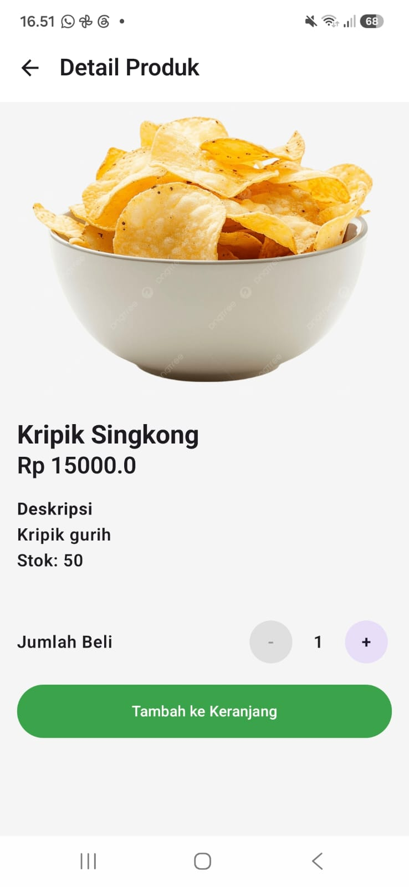
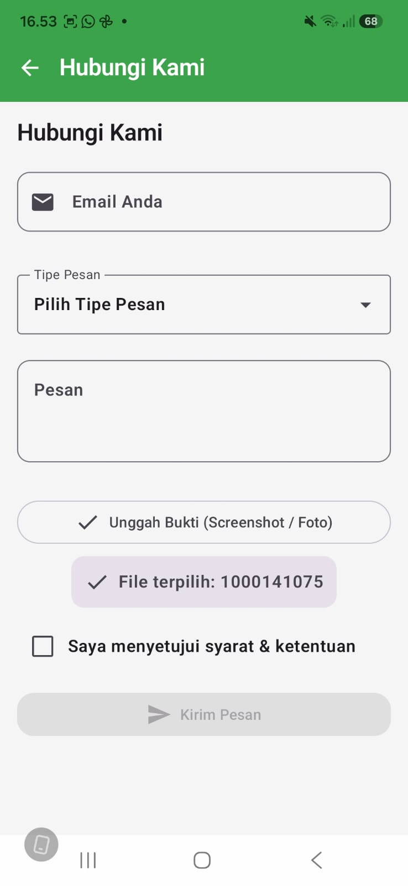

# Laporan Praktikum Pemrograman Mobile

**Nama**        : Wakhid Nugroho  
**NIM**         : H1D024003  
**Shift**       : Awal H / Akhir C  
**Praktikum**   : Pemrograman Mobile

---

## 📝 Tugas Pertemuan 1
**Tanggal**: Selasa, 1 September 2026

**Kesimpulan Praktikum:**  
Pada pertemuan pertama, praktikum berfokus pada pembuatan antarmuka dasar halaman informasi aplikasi ("Tentang Jualan"). Praktikan belajar menyusun struktur tata letak UI statis menggunakan Jetpack Compose, seperti menambahkan logo, teks deskripsi platform UMKM, kartu informasi misi, serta tombol navigasi.

---

## 📝 Tugas Pertemuan 2
**Tanggal**: Selasa, 8 September 2026

**Kesimpulan Praktikum:**  
Pada pertemuan kedua, praktikum berfokus pada pembuatan form interaktif pada halaman "Hubungi Kami". Praktikan belajar mengimplementasikan komponen input teks (`OutlinedTextField`) untuk email dan pesan, tombol pengiriman (`Button`), serta mengelola status antarmuka agar pengguna dapat berinteraksi dan mengirimkan masukan secara dinamis.

---

## 📝 Tugas Pertemuan 3
**Tanggal**: Selasa, 15 September 2026

**Kesimpulan Praktikum:**  
Pada pertemuan ketiga, praktikum berfokus pada pembuatan halaman katalog "Daftar Produk UMKM" yang komplek. Praktikan belajar mengimplementasikan tata letak grid dan daftar (`LazyVerticalGrid` & `LazyRow`), filter kategori produk (Makanan, Minuman, Kerajinan), serta menampilkan kartu produk lengkap dengan gambar aset lokal, label kategori, nama produk, dan harga secara terstruktur.

---

## 📝 Tugas Pertemuan 4
**Tanggal**: Selasa, 22 September 2026

**Kesimpulan Praktikum:**  
Pada pertemuan keempat, praktikum berfokus pada Recomposition, UI Lifecycle, pengelolaan State, dan Jetpack Navigation. Praktikan belajar menerapkan State Hoisting & Unidirectional Data Flow (UDF) untuk memisahkan Stateful dan Stateless Composable, validasi form interaktif (Dropdown, Checkbox, PhotoPicker & Permission), simulasi proses asinkronus menggunakan `LaunchedEffect`, serta navigasi antarlayar (Daftar Produk, Detail Produk, dan Hubungi Kami).

